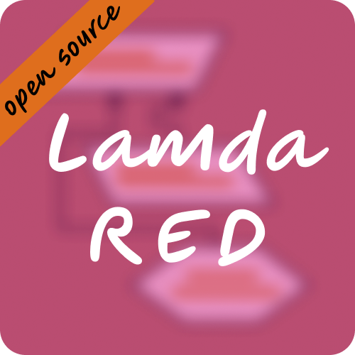

<div align="center">
    
    <p>LamdaRED is a simple way to create your Requirement Engineering diagrams
    without using a mouse or the complex interface of draw.io just by using
    straightforward syntax!</p>
</div>

## Syntax

```txt
/A Requirement Goal/
\A Requirement Risk Shape\
<Agent processes over a specific Goal>
```

## TODO

+ [x] Make it standalone instead of import exported `.xml` file to draw.io app
    + [x] Create a converter to png
    + [ ] Create three shape
        + [ ] Hexagon
        + [ ] Parallelogram
        + [ ] Flipped Parallelogram
    + [ ] Create compatible paper to generate `png` with proper `width` and
    `height` size
    + [ ] Dynamic width and height object size
    + [ ] Dynamic width object proximity
    + [x] Dynamic height object proximity
+ [ ] Create line between two and a few objects
+ [ ] Connection and communication between levels
+ [ ] Make it web-based service
+ [ ] React App, it can request to a Rust server
+ [ ] Serve `png` as production of diagrams into server-client
+ [ ] Define comment rule in `lamda_red` pest grammar.


[official](https://jgraph.github.io/mxgraph/docs/js-api/files/model/mxGraphModel-js.html)
MXGraphModel documentation.

## Running

```sh
cargo update # fetch dependencies 
cargo run # Compiling
```