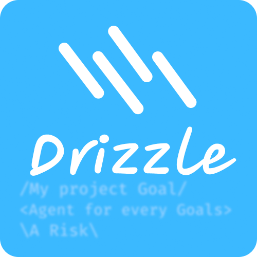
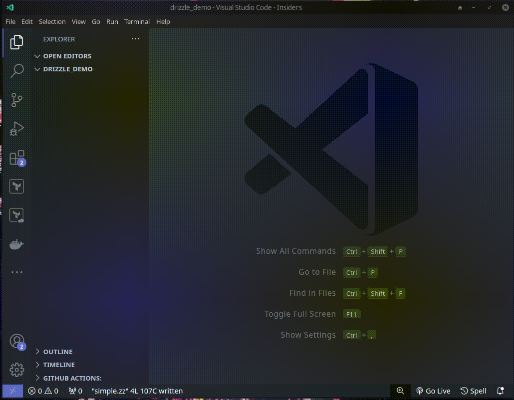

<div align="center">
    
    <h1>A Simple RED Language Support</h1>
</div>

Drizzle is a simple language support extension for Lamda RED to draw your Risk,
Goal and Agent diagrams projects with straightforward syntax.

## Demo

<div align="center">
    
</div>

## Sample

```drizzle
&& This is drizzle file to compile with Lamda_RED tool
                
/This is a simple Goal/
\This is a simple Risk\
<Agent will connect to a Goal>
```

## Known Issues

- [ ] It can't support variables

## Release Notes

### 1.0.0

Initial release of Drizzle